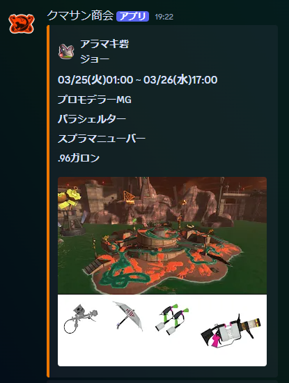

# 概要
サーモンランのシフト情報を定期的に投稿するDiscord Webhook用APIです。\
GAS(GoogleAppsScript)上で動作します。

# 使い方
## Discord Webhookの設定
1. Discordから投稿したいチャンネルを開きます。
1. 「サーバー設定」→「連携サービス」→「ウェブフック」を選択します。
1. 「新しいウェブフック」をクリックします。
1. ウェブフックが作られるので、任意の名前と通知先チャンネルを設定後、「ウェブフックURLをコピー」をクリックします。\
※コピーしたURLはGASの設定にて利用します。

## GASの設定
### プロジェクトの作成
1. [Apps Script](https://script.google.com/home)にアクセスします。
1. 「新しいプロジェクト」をクリックします。
1. エディタ画面が開くので、[main.js](public/main.js)の内容をコピーして貼り付けます。

### ライブラリを追加
1. 「ライブラリ」クリック→以下のライブラリIDを入力します。\
   - dayjsライブラリ\
   `1ShsRhHc8tgPy5wGOzUvgEhOedJUQD53m-gd8lG2MOgs-dXC_aCZn9lFB`
   - [ImgAppライブラリ](https://github.com/tanaikech/ImgApp)\
   `1T03nYHRho6XMWYcaumClcWr6ble65mAT8OLJqRFJ5lukPVogAN2NDl-y`

### サービスを追加
1. 「サービス」クリック→以下のサービスを選択します。\
    - Google Slides API
    - Drive API

### 環境変数（プロパティ）を設定
1. 「プロジェクトの設定」を開き、画面下部の「スクリプト プロパティ」欄に以下を追加します。\
    - プロパティ名：`discordWebhookUrl`　値：（Webhookの設定でコピーしたURL）
    - プロパティ名：`userAgent`　値：（自分の連絡先）※例：`discordWebhook(X@user_name)`
    - プロパティ名：`folderID`　値：（GoogleDriveのフォルダーのID）※共有している必要があります

### トリガーの設定
1. 「トリガー」を開き、「トリガーを追加」をクリックします。
2. 「実行する関数」で`setTrigger`を選択します。
3. 「時間主導型」/「日付ベースのタイマー」/「午前0時～1時」に設定します。\
※1日1回実行できれば良いので時間帯はいつでもOK

## 動作確認方法
スクリプトエディタ画面で`main`関数を選択して「実行」をクリックします。

# 補足
## サーモンランのスケジュールについて
https://spla3.yuu26.com/ を使わせてもらってます。\
大量に実行しないよう注意しましょう。

## アイコン画像について
作成者のGoogleDriveに保存しています。\
急に使えなくなるかもしれませんのでご留意ください。

## ブキ編成の画像について
追加実装しました。
ブキごとに画像サイズが異なるので少し崩れてます。
調整検討中
